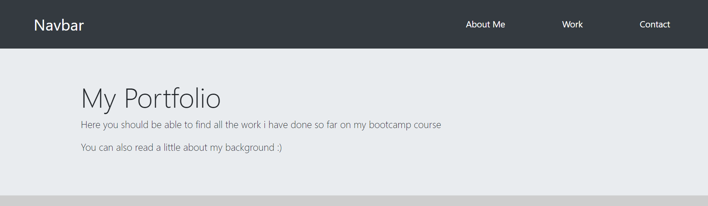

# <Your-Project-Title>

## Description

This project had the aim of creating a portfolio webpage using bootstrap.
Using bootstrap shows me that you can quickly and easily add components that can be difficult to make in HTML and CSS.

## Usage

Here is an example image from my portfolio made using bootstrap

